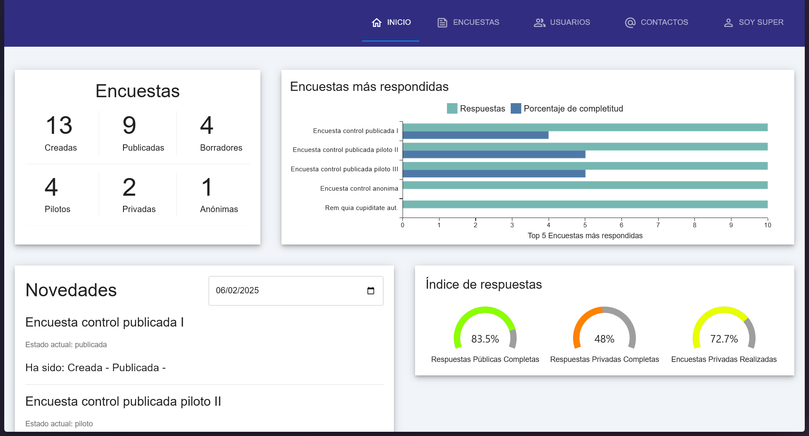
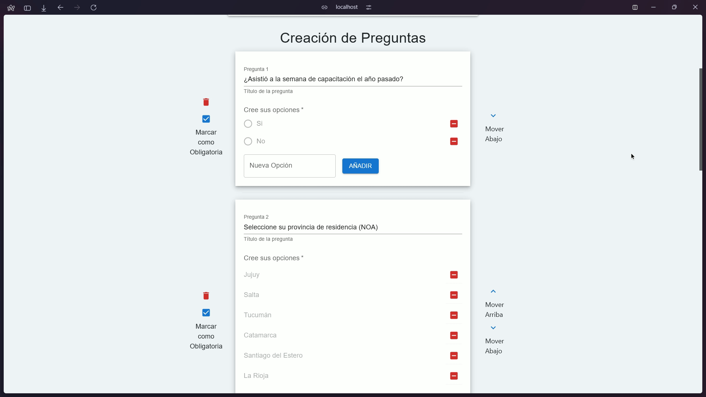
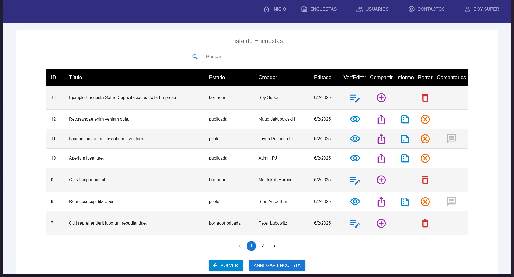
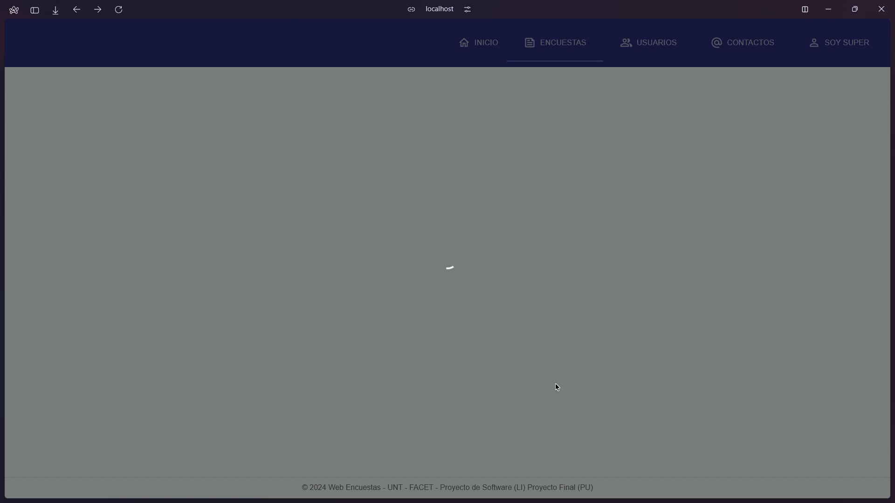

# WebEncuestas / WebSurvey 🌐📊
Is a project made for obtaining the Associate Degree in Computer Programming by the National University of Tucumán. Is not a production-ready implementation. But a showcase of the skills obtained.

[](https://reactjs.org/)
[](https://laravel.com/)
[](https://www.postgresql.org/)

Looking for a full-stack React specialist focused on data-driven applications?
[](https://www.linkedin.com/in/juan-ignacio-carrizo-juani981/)

## 🌟 Key Features / Características Clave
- **Statistical Reporting**: Comprehensive statistical reports generated from survey data, providing insights into user responses.
- **Email Integration**: Seamless integration with email services for notifications and survey distribution.
- **Token-Based User Validation**: Secure user authentication using session tokens for enhanced security.
- **Role-Based Responsabilities**: Many types of users with its own responsabilities and permissions for security and scalability.
- **Broadcast in one click**: Using a contacts pool, the distributors can load big lists of emails at a time to share surveys via email.
- **DDoS Protection**: Implemented IP-based rate limiting to mitigate potential DDoS attacks.
- **Responsive Interface**: A fully responsive design using Material-UI, ensuring optimal user experience across devices.
- **Robust Backend API**: A well-structured RESTful API built with Laravel 10, ensuring efficient data handling and scalability.
- **General Analytics Dashboard**: An interactive dashboard that offers a holistic view of survey performance and analytics.

## 🛠 Tech Stack / Tecnologías
**| Styling |=>** Tailwind CSS, MaterialUI System 

**| Frontend |=>** React 18, JavaScript, Vite, Axios 

**| Backend |=>** Laravel 10, Sanctum Auth, Mailchimp API

**| Database |=>** PostgreSQL, Eloquent ORM


## 📸 Key Screenshots / Capturas Clave
General Surveys showcase in a Dashboard
 
Fully Dynamic creation of questions for the surveys (add, delete, reorder, make mandatory) with multiple types of questions available

Comprehensive List All Surveys, with actions and info about the state of the surveys

Extensive analytics of the Data sent by the users when submiting their answers, available for export in various formats


## 🧠 Why This Project? / ¿Por qué Este Proyecto?
This implementation demonstrates my strongest skills in:

**Clean Architecture:** Separation between UI components and business logic

**Performance:** Memoization, pagination, and virtual scrolling

**Code Quality:** ESLint + Prettier

**Modern Patterns:** Compound components, custom hooks

**Advanced Data Visualization:** MUI X-Charts

## 🚀 Quick Start / Inicio Rápido
All installation prerequisites to run on a local machine are detailed in each corresponding folder (./Front-End and ./Back-End)
```bash
# Frontend
cd Front-End
npm install
npm run dev

# Backend (requiered to use PostgreSQL)
cd Back-End
php composer install
php artisan serve
```
